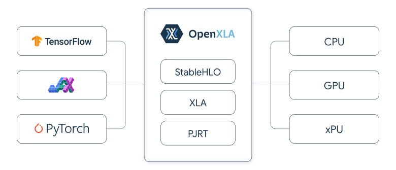

# XLA

XLA (Accelerated Linear Algebra) is an open-source machine learning (ML)
compiler for GPUs, CPUs, and ML accelerators.

<picture>
  <source media="(prefers-color-scheme: dark)" srcset="docs/images/openxla_dark.svg">
  
</picture>

The XLA compiler takes models from popular ML frameworks such as PyTorch,
TensorFlow, and JAX, and optimizes them for high-performance execution across
different hardware platforms including GPUs, CPUs, and ML accelerators.

[openxla.org](https://openxla.org/) is the project's website.

## Get started

If you want to use XLA to compile your ML project, refer to the corresponding
documentation for your ML framework:

* [PyTorch](https://pytorch.org/xla)
* [TensorFlow](https://www.tensorflow.org/xla)
* [JAX](https://jax.readthedocs.io/en/latest/notebooks/quickstart.html)

If you're not contributing code to the XLA compiler, you don't need to clone and
build this repo. Everything here is intended for XLA contributors who want to
develop the compiler and XLA integrators who want to debug or add support for ML
frontends and hardware backends.

## Install step by step

First install bazel 7.4.1;
install musa runtime into local dir ${musa}
rm -rf ${musa}/include/llvm ${musa}/include/mlir ${musa}/include/mlir-c ${musa}/include/llvm-c/
cp /usr/lib/x86_64-linux-gnu/libmusa.so ${musa}/lib/stub/libmusa.so
export MUSA_HOME=${musa}
git clone --recurse-submodules https://gitee.com/PerfXLab/openxla.git
cd openxla
./configure.py --backend=MUSA
bazel build -c dbg --strip=never  --verbose_failures  --spawn_strategy=local   --test_output=all   //xla/...

Test
./bazel-bin/xla/tools/run_hlo_module --platform=MUSA --input_format=hlo ~/moon/github/openxla/xla/tests/fuzz/rand_000006.hlo

## Contribute

If you'd like to contribute to XLA, review
[How to Contribute](docs/contributing.md) and then see the
[developer guide](docs/developer_guide.md).

## Contacts

*   For questions, contact the maintainers - maintainers at openxla.org

## Resources

*   [Community Resources](https://github.com/openxla/community)

## Code of Conduct

While under TensorFlow governance, all community spaces for SIG OpenXLA are
subject to the
[TensorFlow Code of Conduct](https://github.com/tensorflow/tensorflow/blob/master/CODE_OF_CONDUCT.md).
